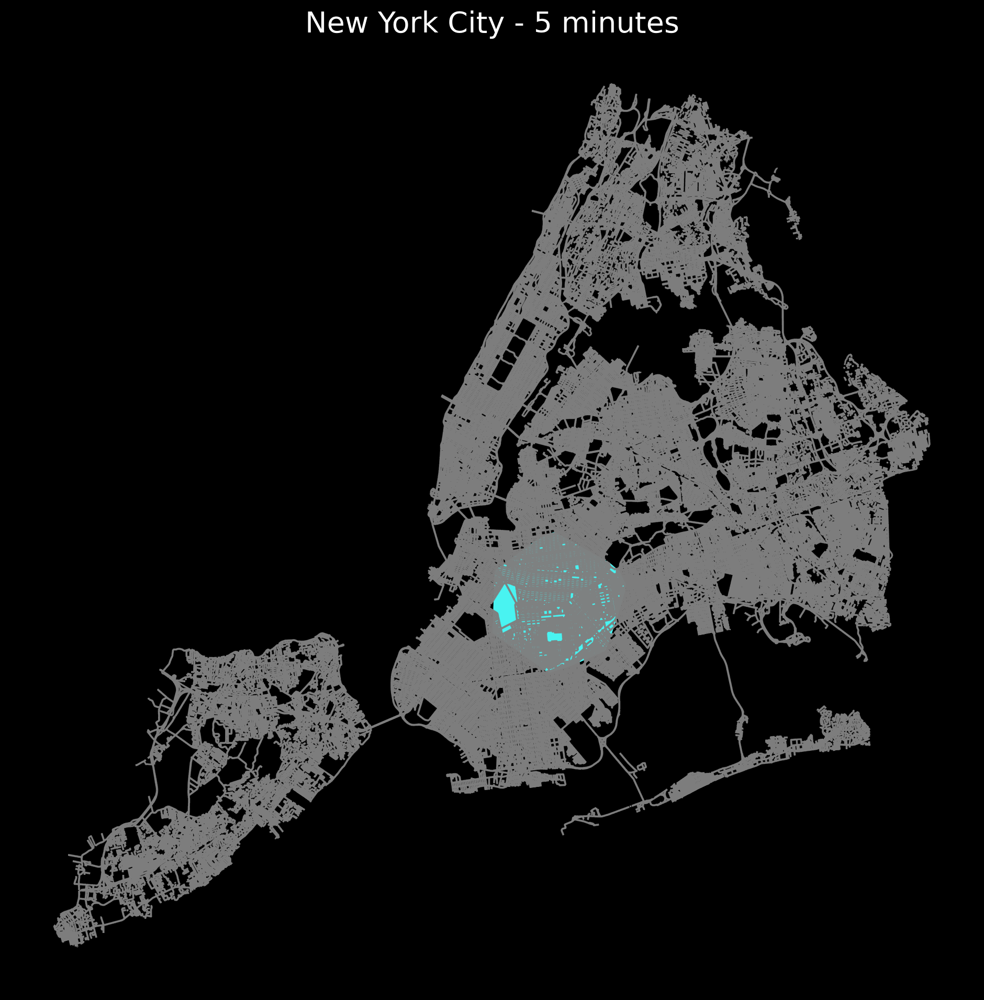

# **SphereStats**

**SphereStats** is a Python library designed for advanced **geospatial analysis** and **spherical geometry operations**. Whether you're working with geographic data, analyzing navigation routes, or performing spatial statistics, SphereStats provides the tools you need to **simplify and streamline workflows**.

---

## **Key Features**

### **1. Distance Calculations**
- **Great-circle distances** using the Haversine formula.
- **Point-to-line** and **point-to-polygon distances** for geofencing and proximity analysis.
- **Midpoint calculations** for navigation and routing.


### **2. Routing and Network Analysis**
- Compute the **shortest paths** between points on a sphere.
- Generate **waypoints** along routes for navigation or migration tracking.
- Calculate **travel distances** along curved paths, such as roads or flight paths.


### **3. Geometric and Statistical Analysis**
- **Centroid** and **bounding circle** calculations for multiple points on a sphere.
- **Convex hull computations** for clustering and spatial extents.
- **Cluster points** based on distance thresholds or other metrics.


### **4. Proximity Analysis**
- Generate **buffer zones** around points, lines, or polygons.
- Perform **distance threshold queries** for proximity-based operations.

### **5. Visualization**
- Render **routes, heatmaps, and geometric shapes** on various map projections.
- Visualize **great-circle arcs** and **spherical triangles** for navigation and celestial mapping.


### **6. Advanced Metrics**
- **Spherical triangle calculations** for navigation.
- **Isochrone maps** showing areas reachable within time thresholds.


### Visualizing Isochrones for New York
Below is an example of isochrones for New York:




---

## **Installation**

Install SphereStats using pip:

```bash
pip install SphereStats

Examples of Inputs and Outputs

Example 1: Distance Calculations

The `calculate_great_circle_distance` function computes the shortest distance between two points on a sphere using the Haversine formulas.

 Inputs
- `point1`: A tuple `(latitude, longitude)` for the first point.  
  Example: `(40.748817, -73.985428)` *(New York)  
- `point2`**: A tuple `(latitude, longitude)` for the second point.  
  Example: `(34.052235, -118.243683)` (Los Angeles) 

  Outputs
- `distance`: The great-circle distance between the two points in kilometers.


Example 2: Routing
Inputs
start_point: A tuple (latitude, longitude) for the starting location.
Example: (40.748817, -73.985428) (New York)
end_point: A tuple (latitude, longitude) for the ending location.
Example: (34.052235, -118.243683) (Los Angeles)

Outputs
waypoints: A list of tuples representing intermediate points along the route.


Visualizing a Convex Hull on a Sphere

Inputs
points: A list of coordinates, where each coordinate is a tuple (latitude, longitude).
Outputs
hull: A list of indices representing the convex hull points.
cartesian_points: The corresponding 3D Cartesian points of the input coordinates.


Example Usage

from SphereStats.convex_hull import convex_hull_on_sphere, plot_convex_hull_3d

# Define latitude and longitude points
points = [
    [40.748817, -73.985428],  # New York
    [34.052235, -118.243683],  # Los Angeles
    [48.8566, 2.3522],  # Paris
    [-33.8688, 151.2093],  # Sydney
    [35.6895, 139.6917],  # Tokyo
]

# Compute the convex hull
hull, cartesian_points = convex_hull_on_sphere(points)

# Visualize in 3D
plot_convex_hull_3d(hull, cartesian_points)


Applications

Navigation and Routing
Calculate optimal routes and travel paths.
Analyze waypoint-based navigation for flights and shipping.
Geospatial Analysis
Assess proximity to protected areas, hazard zones, or geofences.
Perform clustering and resource allocation using spherical statistics.
Data Visualization
Generate intuitive maps and spherical projections for spatial data.
Urban Planning and Infrastructure
Plan routes, assess coverage zones, and analyze accessibility.


Requirements

Python >= 3.8
Required packages:
numpy
scipy
matplotlib
cartopy
pyproj

Contributing

Contributions are welcome! If you have suggestions, bug reports, or feature requests, feel free to submit an issue or pull request on the GitHub repository.

License

This project is licensed under the MIT License. See the LICENSE file for details.


