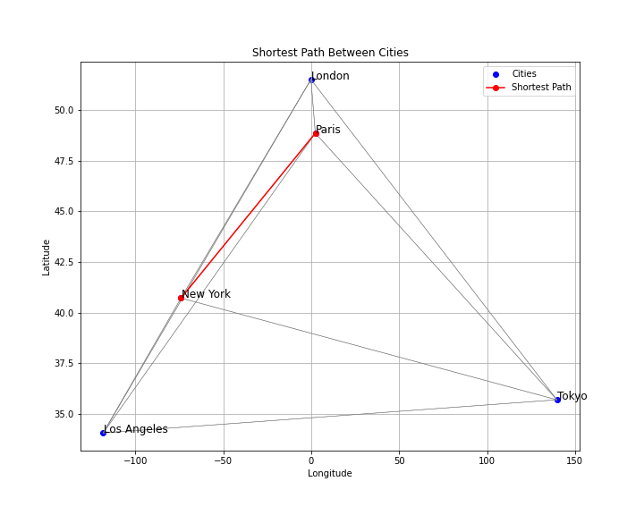
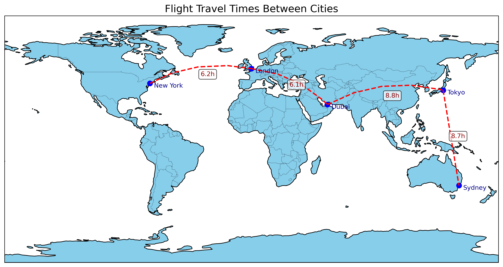
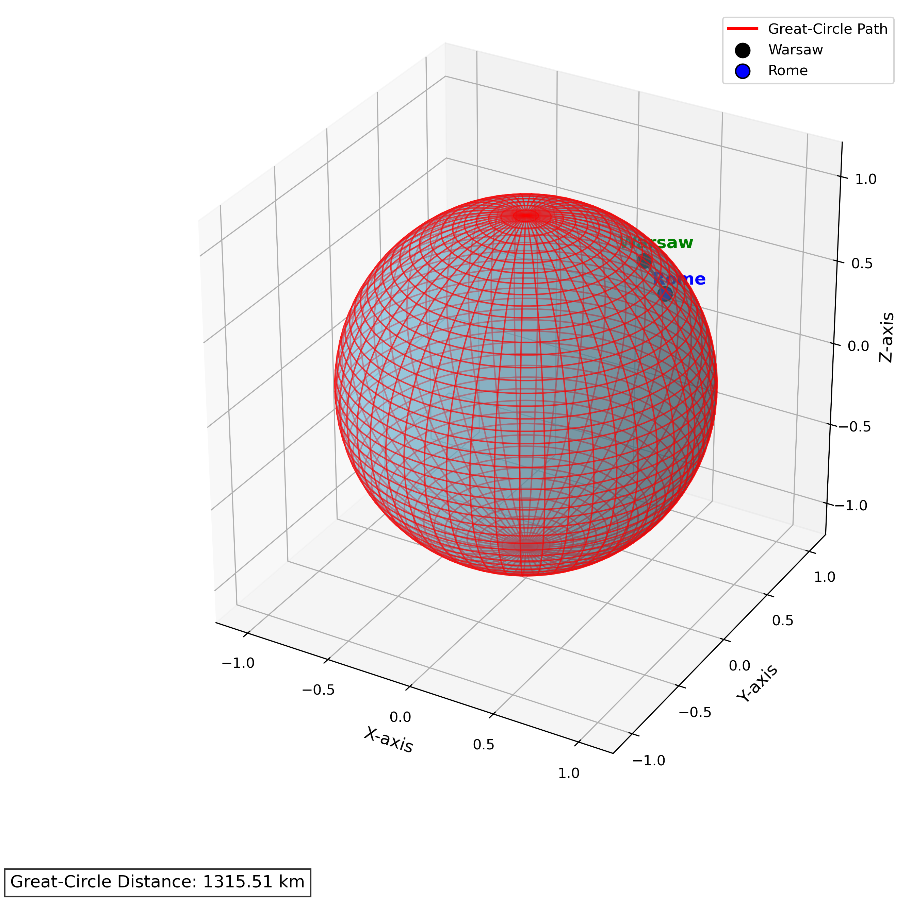

# **SphereStats**

**SphereStats** is a Python library designed for advanced **geospatial analysis** and **spherical geometry operations**. Whether you're working with geographic data, analyzing navigation routes, or performing spatial statistics, SphereStats provides the tools you need to **simplify and streamline workflows**.

---

## **Key Features**

### **1. Distance Calculations**
- **Great-circle distances** using the Haversine formula.
- **Point-to-line** and **point-to-polygon distances** for geofencing and proximity analysis.
- **Midpoint calculations** for navigation and routing.


### **2. Routing and Network Analysis**
- Compute the **shortest paths** between points on a sphere.
- Generate **waypoints** along routes for navigation or migration tracking.
- Calculate **travel distances** along curved paths, such as roads or flight paths.


### **3. Geometric and Statistical Analysis**
- **Centroid** and **bounding circle** calculations for multiple points on a sphere.
- **Convex hull computations** for clustering and spatial extents.
- **Cluster points** based on distance thresholds or other metrics.


### **4. Proximity Analysis**
- Generate **buffer zones** around points, lines, or polygons.
- Perform **distance threshold queries** for proximity-based operations.

### **5. Visualization**
- Render **routes, heatmaps, and geometric shapes** on various map projections.
- Visualize **great-circle arcs** and **spherical triangles** for navigation and celestial mapping.


### **6. Advanced Metrics**
- **Spherical triangle calculations** for navigation.
- **Isochrone maps** showing areas reachable within time thresholds.


### Visualizing Isochrones for New York
Below is an example of isochrones for New York:


This example demonstrates how to calculate the shortest path between cities using Dijkstra's algorithm and visualize the network of cities on a 2D map. The cities are represented by their geodesic distances, and the shortest path between two cities (New York and Paris) is highlighted.

### Code Explanation
1. **Geodesic Distance Calculation**: The script uses the Haversine formula to calculate the great-circle distance between cities on the Earth's surface based on their latitude and longitude.
   
2. **Dijkstra's Algorithm**: This algorithm is used to find the shortest path in a weighted graph of cities. The cities are connected to each other based on their calculated geodesic distances.

3. **Visualization**: The cities are plotted on a map, and the shortest path between New York and Paris is highlighted in red.

### Example of Plot
Here is the plot showing the network of cities and the shortest path from **New York** to **Paris**:




# Flight Travel Times Between Major Cities

This project calculates and visualizes the flight travel times between several major cities across the globe using great-circle distances (haversine formula). The average commercial flight speed is assumed to be 900 km/h.

## Key Components

- **Haversine Formula**: Calculates the great-circle distance between two latitude/longitude points on the Earth's surface.
- **City Coordinates**: Defines the geographical coordinates for selected major cities (New York, London, Dubai, Tokyo, Sydney).
- **Travel Data**: Computes distances and estimated travel times between specified pairs of cities.
- **Map Visualization**: Uses `Matplotlib` and `Cartopy` to plot a world map, marking cities and drawing great-circle routes between them. The plot annotates each route with the corresponding travel time.

## Plot

The plot showcases:
- City locations marked with blue dots.
- Red dashed lines representing the shortest flight paths (great-circle routes).
- Travel times between cities, annotated along the routes.



### Great Circle Path Visualization

#### Overview

This project visualizes the Great Circle Path, the shortest route between two cities on a 3D sphere (representing Earth). The path is calculated using the Haversine formula, which determines the shortest distance between two points on a sphere.

#### Code Explanation

- **`to_cartesian(lat, lon)`**: Converts latitude and longitude to Cartesian coordinates for 3D plotting.
- **`haversine(lat1, lon1, lat2, lon2)`**: Calculates the great-circle distance between two points on Earth using the Haversine formula.
- **`plot_great_circle_with_stats(lat1, lon1, lat2, lon2)`**: Plots the 3D sphere, the great-circle path, and the cities' locations, and shows the calculated distance.

#### Example Coordinates

- **Warsaw**: (52.2296756, 21.0122287)
- **Rome**: (41.8919300, 12.5113300)

#### Plot Description

- The plot shows a 3D sphere with the cities marked by dots.
- A red line represents the Great Circle Path.
- The distance between the two cities is displayed outside the plot.




---
## **Installation**

To install SphereStats, use pip:

```bash
pip install SphereStats
Examples of Inputs and Outputs

Example 1: Distance Calculations
The calculate_great_circle_distance function computes the shortest distance between two points on a sphere using the Haversine formula.

Inputs:

point1: A tuple (latitude, longitude) for the first point.
Example: (40.748817, -73.985428) (New York)
point2: A tuple (latitude, longitude) for the second point.
Example: (34.052235, -118.243683) (Los Angeles)
Outputs:

distance: The great-circle distance between the two points in kilometers.
Example 2: Routing
Inputs:

start_point: A tuple (latitude, longitude) for the starting location.
Example: (40.748817, -73.985428) (New York)
end_point: A tuple (latitude, longitude) for the ending location.
Example: (34.052235, -118.243683) (Los Angeles)
Outputs:

waypoints: A list of tuples representing intermediate points along the route.
Visualizing a Convex Hull on a Sphere
Inputs:

points: A list of coordinates, where each coordinate is a tuple (latitude, longitude).
Outputs:

hull: A list of indices representing the convex hull points.
cartesian_points: The corresponding 3D Cartesian points of the input coordinates.
Example Usage

from SphereStats.convex_hull import convex_hull_on_sphere, plot_convex_hull_3d

# Define latitude and longitude points
points = [
    [40.748817, -73.985428],  # New York
    [34.052235, -118.243683],  # Los Angeles
    [48.8566, 2.3522],  # Paris
    [-33.8688, 151.2093],  # Sydney
    [35.6895, 139.6917],  # Tokyo
]

# Compute the convex hull
hull, cartesian_points = convex_hull_on_sphere(points)

# Visualize in 3D
plot_convex_hull_3d(hull, cartesian_points)
Applications

Navigation and Routing:
Calculate optimal routes and travel paths.
Analyze waypoint-based navigation for flights and shipping.
Geospatial Analysis:
Assess proximity to protected areas, hazard zones, or geofences.
Perform clustering and resource allocation using spherical statistics.
Data Visualization:
Generate intuitive maps and spherical projections for spatial data.
Urban Planning and Infrastructure:
Plan routes, assess coverage zones, and analyze accessibility.
Requirements

Python >= 3.8
Required packages:

numpy
scipy
matplotlib
cartopy
pyproj
Contributing

Contributions are welcome! If you have suggestions, bug reports, or feature requests, feel free to submit an issue or pull request on the GitHub repository.

License

This project is licensed under the MIT License. See the LICENSE file for details.

